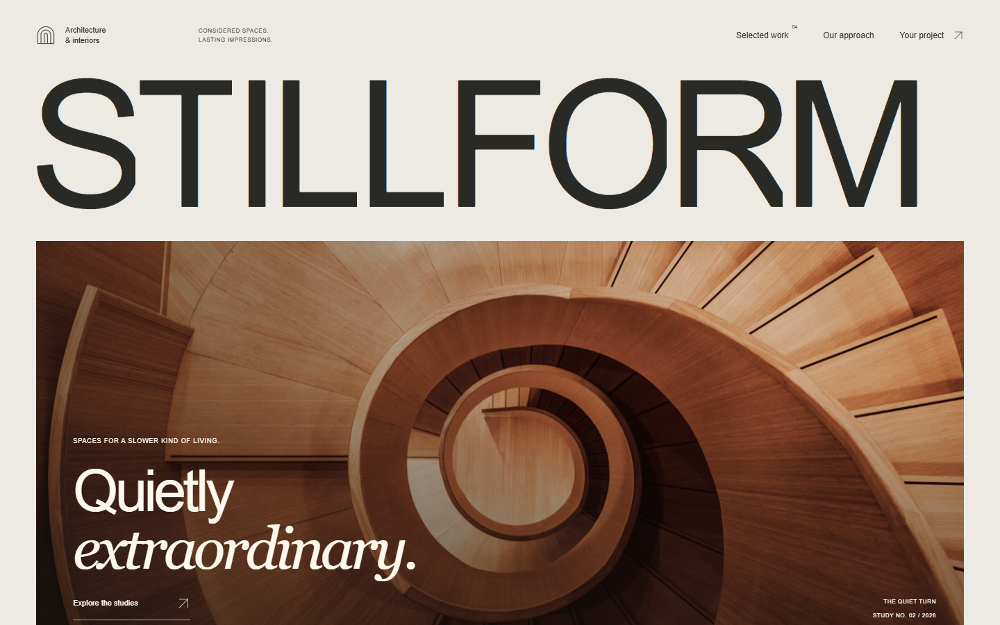
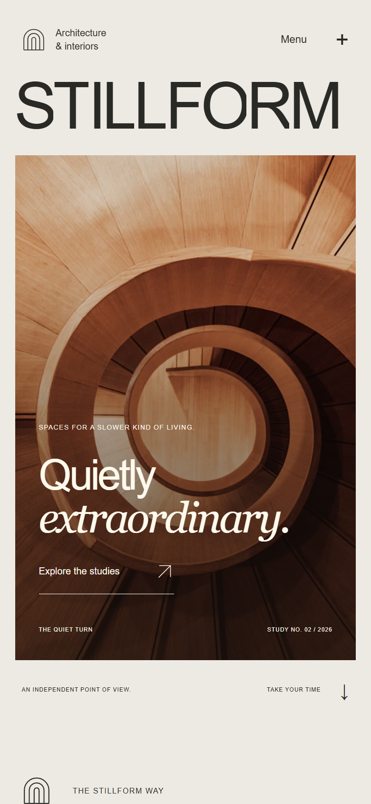

<p align="center"></p>

<p align="center">
  <a href="https://15-stillform.williamking.workers.dev"></a>
  
  
  
  
  
  
</p>

**A fictional architecture and interiors practice.** Monumental typography, licensed architectural photography, a filterable study gallery, an interactive material index and a project brief you can edit and download.

<p align="center"></p>

## What you can do

- **Filter four design studies**, open one, change its crop, move with the arrow keys and close with Escape.
- **Explore texture, light and form** in the interactive material index.
- **Follow a drawn plan** and moving daylight through the process section.
- **Browse the gallery**, with thumbnails and working image zoom.
- **Write a brief:** choose a project type, scale, timing and priorities, then review, edit and download it as text. Nothing is submitted or stored remotely.

## What's inside

- **GSAP text and image reveals** with SplitText, Flip filters and DrawSVG plans, over native scrolling.
- **A persistent header** with a reading rule, mobile menu, keyboard focus path and a motion switch.
- **Readable before JavaScript loads**, with OS reduced motion respected and zero axe violations in the final review.
- **Honest credits:** every photograph is licensed and credited, and the site does not claim authorship of the buildings.

## Screenshots

| Desktop | Phone |
| --- | --- |
|  |  |

## Built with

React, GSAP (SplitText, Flip, DrawSVG, ScrollTrigger), Tailwind CSS with Lightning CSS, TypeScript, Vite and Bun. No Three.js.

## Run it locally

```sh
bun install --frozen-lockfile --ignore-scripts
bun run dev      # http://127.0.0.1:4525/
bun run check    # TypeScript, Biome, domain tests and the prerendered build
bun run preview  # http://127.0.0.1:4625/ after bun run build
```

Design and verification: [DESIGN.md](DESIGN.md), [docs/visual/VERIFICATION.md](docs/visual/VERIFICATION.md), [docs/visual/SCORECARD.md](docs/visual/SCORECARD.md) and the working history in [docs/PROJECT-NOTES.md](docs/PROJECT-NOTES.md).

## Credits

Photographs are credited with their source, licence and processing in [CREDITS.md](CREDITS.md) and [assets.manifest.json](assets.manifest.json). The practice and its studies are fictional.

---

<p align="center"><sub>Part of William King's portfolio collection.</sub></p>
