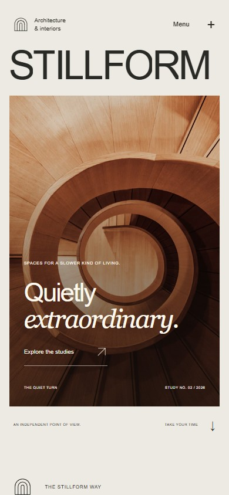
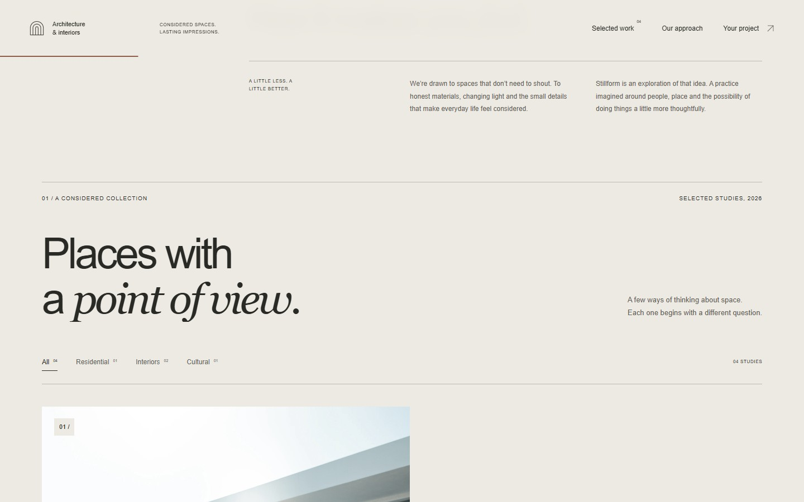

# STILLFORM

<p align="center"></p>

A fictional architecture and interiors practice presented through monumental type, credited architectural photography and useful editorial interactions. Browse four studies, examine materials and daylight, then assemble a project brief you can review, edit and download.

**[Visit the practice →](https://15-stillform.williamking.workers.dev)** · [Run locally](#run-locally) · [Credits](#credits)

<p align="center"></p>

## From a study to your own brief

1. **Browse four design studies.** Filter the work, open a study and move between it and its neighbours through thumbnails, arrows or keyboard controls.
2. **Look closer.** Change the image crop to inspect detail. Switching studies resets the crop, and the phone gallery brings the new image back into view.
3. **Explore material notes.** Texture, light and form each have a visual study, descriptive copy and a path to related work.
4. **Follow the process.** An original drawn plan and moving daylight give the approach section a visual explanation.
5. **Write a brief.** Choose project type, scale, timing and priorities. Review the assembled summary, edit your choices and download a text file. Nothing is submitted; the form has no backend.

The practice and project narratives are fictional. Photographs depict credited reference architecture; this portfolio does not claim authorship of the buildings.

## Typography, imagery and native scrolling

GSAP SplitText reveals the type, Flip animates filtered work and DrawSVG traces the plan. ScrollTrigger coordinates image apertures and daylight while the page keeps native scrolling. A persistent navigation header, reading rule and mobile menu make the long-form content accessible from more than one entry point.

The motion switch works alongside the OS reduced-motion preference. Dialogs provide labelled controls, Escape handling and focus return. Image zoom has its own transform layer, separate from the entrance animation, so the detail view remains functional when a reveal has played.

## Frontend architecture

React, strict TypeScript, GSAP, Tailwind and Lightning CSS power the page; there is no Three.js or game runtime. Static prerendering exposes the core copy and studies before JavaScript. Responsive, locally served photographs avoid a runtime image-service dependency, and the larger gallery imagery loads as needed.

- [src/App.tsx](src/App.tsx): filters, study dialog, materials, process and brief workflow.
- [src/content.ts](src/content.ts): study content and related data.
- [src/motion.ts](src/motion.ts): shared motion behaviour.
- [tools/prerender.tsx](tools/prerender.tsx): readable static HTML.
- [DESIGN.md](DESIGN.md): the site's design and interaction intent.

## Recorded verification

The current application revision is `3285774`. The implementation review recorded **five domain tests / 21 assertions**, 30 browser regressions, 16 refinement interactions and four final gallery/zoom checks. The actual zoom ratio, study changes, downloadable brief, keyboard paths and no-JavaScript content were checked. Final sampled states had no browser errors or automated axe violations. See [VERIFICATION.md](docs/visual/VERIFICATION.md) for the evidence and its limits.

## Current screenshots

| Desktop | Phone |
| --- | --- |
|  |  |



The opening loop and three main screenshots were captured from the live site on **1 October 2026**, using Chrome on this workstation; the phone image is a 390 × 844 browser viewport. The animated preview is a short loop, not a full playthrough. [Capture details](docs/readme/capture.json).

## Run locally

Use **Bun 1.3.10** (the version pinned in `package.json`) and Node.js 22.12 or newer. From this repository:

```sh
bun install --frozen-lockfile
bun run dev      # http://127.0.0.1:4525/
bun run check    # strict types, Biome, unit tests and production build
bun run preview  # http://127.0.0.1:4625/ after the build
```

Development and preview are separate long-running commands; run one at a time or use separate terminals. `bun run build` writes the static production output to `dist/`. Dependencies and the lockfile are local to this project.

## Stack and release

React 19.3 · strict TypeScript · Vite 8.3 · GSAP 3.15 · Tailwind CSS 4.3 · Bun 1.3.10 · Biome. The public website is served by Cloudflare Workers. This README describes [application revision 3285774](https://github.com/WilliamHenryKing/15-stillform/commit/3285774901bdd11e654dfcefa630a8a8dc769c51); the documentation refresh changes no application behaviour.

## Credits

Photographs are credited with their source, licence and processing in [CREDITS.md](CREDITS.md) and [assets.manifest.json](assets.manifest.json). The practice and its studies are fictional.

---

Part of [William King's portfolio collection](https://github.com/WilliamHenryKing).
